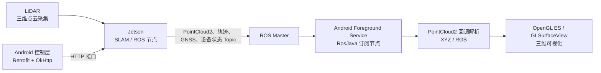

  <h1>退化场景 SLAM 系统 Android 客户端</h1>
  
<strong>实验室 × 香港理工大学跨校合作研发｜Android 移动上位机</strong>

  
面向 GNSS 拒止环境下四足机器人救援的设备控制、ROS 数据接入与三维点云可视化。

  

    <a href="#-项目概览">项目概览</a> ·
    <a href="#-核心实现">核心实现</a> ·
    <a href="#-技术栈">技术栈</a> ·
    <a href="#-项目说明">项目说明</a>
  

   
  
  
  
  
  

---

## 🧭 项目概览

系统由 LiDAR、Jetson 边缘计算平台和 Android 移动端组成：Jetson 侧运行 SLAM 与 ROS 节点，Android 端作为移动上位机，负责设备控制、ROS 话题订阅与三维可视化。

## 🎬 项目演示视频

🎬 [查看项目演示视频](https://gcnbv9droju6.feishu.cn/wiki/MjMmweZqQipy92kpkSxcCM6nnUh?from=from_copylink)

## ✨ 核心实现

### 三端数据通信链路

搭建 **LiDAR 采集三维点云 → Jetson 侧 ROS 节点封装为 PointCloud2 并发布 Topic → App 通过 Foreground Service 运行 RosJava 节点、连接 ROS Master 后订阅点云、轨迹、GNSS 及设备状态 Topic → 回调线程解析顶点坐标与 RGB** 的多设备通信链路。

其中，`PointCloud2` 是 ROS 的二进制点云消息格式；Topic 是 ROS 的发布/订阅消息通道。Android 端订阅到新消息后触发回调，完成点云数据解析并交由 OpenGL ES 绘制。

### 设备控制与状态同步

设计基于 **Retrofit + OkHttp** 的设备控制层，统一封装采集启停、传感器自检、磁盘检查等 HTTP 接口；通过拦截器集中处理日志、超时与重试，并将设备状态轮询与 UI 状态机联动，保持采集状态与页面反馈一致。

### 三维点云交互展示

基于 `GLSurfaceView` 自定义渲染组件构建点云视图，在 OpenGL 渲染线程中完成透视投影、深度测试和模型矩阵变换；通过 `onTouchEvent` 接入缩放、旋转、平移手势，实现移动端三维点云浏览。

### 高频长时采集性能优化

针对高频、长时点云采集场景中频繁动态分配内存、内存持续上涨和渲染卡顿问题，设计双缓冲内存复用模块；初始化时预分配两块固定容量缓冲区，在帧间交替、逐帧复用，减少频繁 `malloc/free` 带来的内存碎片。连续采集 10 分钟、累计点云数据约 10 GB 时，移动端平均内存占用降低 38%。

## 🛠 技术栈

| 领域 | 技术 |
| --- | --- |
| Android | Java、XML、Foreground Service、Handler |
| 网络控制 | Retrofit、OkHttp、HTTP、JSON |
| 机器人通信 | ROS、RosJava、ROS Master、PointCloud2、Topic 发布/订阅 |
| 三维渲染 | OpenGL ES、GLSurfaceView、FloatBuffer |

## 📌 项目说明

- 本仓库用于展示 Android 客户端的项目设计与技术方案，不包含 Jetson 端 SLAM 算法、FAST-LIVO2 配置、传感器驱动、实验数据、设备地址或凭据。
- LiDAR、Jetson 与 Android 端均位于实验现场局域网；Android 端负责控制指令下发和 ROS 数据订阅，不承载 SLAM 算法计算。
