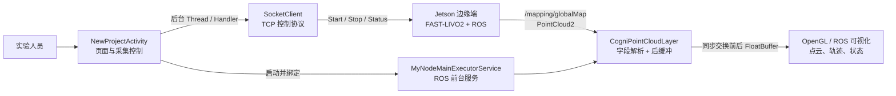

# Spatial Wiz

> 面向地下矿洞、隧道等 GNSS 拒止场景的 SLAM 系统 Android 移动交互终端。
>
> Android 客户端负责采集任务控制、ROS 数据订阅与三维点云可视化；算法与传感器融合运行在 Jetson 边缘端的 FAST-LIVO2 环境中。

`Android Native` · `Java` · `RosJava` · `TCP Socket` · `OpenGL ES`

[项目概览](#-项目概览) · [核心特性](#-核心特性) · [技术栈](#-技术栈) · [系统架构](#-系统架构) · [真实性能验证](#-真实性能验证) · [简历表述](#-简历表述)

---

## 🧾 项目概览

Spatial Wiz 是实验室机器人 SLAM 系统的 Android 上位机。实验人员通过手机连接 Jetson 边缘端，发起采集、停止和状态查询；Jetson 端运行 FAST-LIVO2 并经 ROS 发布点云与状态数据，客户端订阅 `sensor_msgs/PointCloud2`，在移动端完成二进制解析、缓冲同步与三维显示。

### 简历项目写法（无性能数值版）

**退化场景 SLAM 系统 Android 客户端** ｜ Java · Android View/XML · RosJava · TCP Socket · OpenGL ES

*项目简介：* 面向地下矿洞、隧道等 GNSS 拒止环境的机器人救援定位与建图场景，开发 Android 上位机，实现 Jetson 端 FAST-LIVO2 采集任务控制、ROS 点云/状态订阅及三维可视化。

*项目职责：*

- *分层与控制链路：* 将页面交互、TCP 指令通信、ROS 节点生命周期、点云解析与渲染拆分为独立模块；由 `NewProjectActivity` 编排采集流程，`MyNodeMainExecutorService` 托管 ROS 节点。
- *异构通信：* 使用 `SocketClient` 封装 Android 到 Jetson 的自定义 TCP 控制协议；耗时指令在后台 `Thread` 执行，经 `Handler` 回传进度与按钮状态，避免网络 I/O 阻塞页面。
- *彩色点云处理：* 订阅 `/mapping/globalMap` 的 `PointCloud2` 消息，按 `PointField` 动态解析 XYZ/RGB 字段；通过 `FloatBuffer` 前后缓冲和 `synchronized` 交换完整帧，避免跨线程读写出现半帧和闪烁。
- *三维交互：* 基于 ROS 可视化组件与 OpenGL ES 展示点云、轨迹、GNSS 和设备状态，支持旋转、缩放与平移交互。

---

## ✨ 核心特性

- **采集控制**：使用 Java TCP Socket 与 Jetson 服务端通信，支持采集任务启动、停止和状态轮询。
- **ROS 节点保活**：以 Android 前台服务托管 `NodeMainExecutorService`；页面绑定服务后，根据设备 IP 与 ROS Master 端口配置节点。
- **实时 PointCloud2 解析**：直接处理 ROS 二进制消息，按字段偏移读取坐标和 RGB 数据，不依赖离线 `.pcd` 文件。
- **缓冲同步显示**：ROS 回调写入后缓冲，绘制逻辑读取前缓冲；在同步锁保护下交换缓冲区引用。
- **三维可视化与手势交互**：提供点云、轨迹及设备状态展示，支持旋转、缩放和平移操作。
- **统一紫色主题 UI**：对设备连接、项目、状态、工具箱和弹窗等界面资源进行主题统一。

## 🧰 技术栈

| 领域 | 实际使用的组件 |
| --- | --- |
| Android | Java 8、Android View/XML、Handler、Thread、Foreground Service |
| ROS | RosJava、ROS Master、`sensor_msgs/PointCloud2`、`nav_msgs`、`geometry_msgs` |
| 网络 | Java TCP Socket、自定义文本/JSON 控制协议 |
| 图形 | OpenGL ES、GLSurfaceView、FloatBuffer |
| 设备与地图 | AMap SDK、设备发现与网络连接 |

## 🏗 系统架构



## 🔍 核心实现

### 控制链路

采集按钮触发后，`NewProjectActivity` 在后台线程调用 `SocketClient.runCmd(...)`；控制结果经 `Handler` 更新进度弹窗和按钮状态。客户端控制流与点云显示流独立，避免网络操作占用 UI 线程。

### ROS 生命周期

`MyNodeMainExecutorService` 继承 ROS 的 `NodeMainExecutorService`。页面在设备连接后以设备 IP、ROS Master 端口完成服务绑定和节点配置，再启动点云、GNSS、卫星数、TCP 修正与设备状态等 ROS 节点。

### PointCloud2 到彩色点云

`CogniPointCloudLayer` 订阅 `/mapping/globalMap`。在 `onNewMessage()` 中读取 `PointField`，从二进制 `ChannelBuffer` 按字段偏移提取 XYZ/RGB，再写入顶点与颜色 `FloatBuffer`。

### 前后缓冲同步

解析线程持续生成后缓冲，渲染端只消费前缓冲。完整帧准备完成后，在 `synchronized` 保护下交换两个缓冲区引用，避免渲染中途读到正在写入的数据。

## 📊 真实性能验证

本展示仓库不使用未经验证的 FPS、延迟或“提升百分比”。真实实验环境具备后，应记录以下数据：

| 指标 | 如何获取 | 能证明的工程价值 |
| --- | --- | --- |
| `/mapping/globalMap` 发布频率、带宽 | Jetson 端运行 `rostopic hz`、`rostopic bw` | 客户端面对的真实点云输入压力 |
| PointCloud2 回调频率 | 在 `CogniPointCloudLayer.onNewMessage()` 中按秒计数 | Android 端实际接收能力 |
| 单帧解析和缓冲交换耗时 | 在 `updateVertexBuffer()` 前后记录耗时 | 二进制解析与同步缓冲成本 |
| 采集控制完成时间、成功率 | 记录点击开始到状态确认的时长和连续成功次数 | TCP 控制链路可靠性 |
| Java 堆、GC、CPU、ANR | Android Studio Profiler 连续运行采样 | 长时间点云显示的稳定性 |

> 该项目当前使用 1 秒轮询查询采集状态。因此控制耗时应按实际测试写为秒级结果，不能包装成“毫秒级响应”。

## 📝 测完后的简历量化写法

只在获得真实日志/Profiler 数据后，将下列方括号替换为测量值：

```text
• 在 Jetson 端 /mapping/globalMap 持续发布 [X Hz]、[Y MB/s] 点云流的条件下，客户端单帧 PointCloud2 解析与前后缓冲交换平均耗时 [Z ms]；连续展示 [T min] 无 ANR/闪退。

• 基于 FloatBuffer 前后缓冲和 synchronized 完整帧交换，解决 ROS 回调与绘制端并发读写造成的半帧/闪烁问题；Android Studio Profiler 记录 Java 堆峰值 [M MB]、[N] 次 GC。

• 将采集控制请求移出主线程，通过 Thread + Handler 更新局部进度与按钮状态；在连续 [K] 次控制操作中成功率为 [P%]，点击至状态确认平均耗时 [Q s]。
```

这些指标与项目优化点的对应关系是：

- **HZ/带宽 + 解析耗时**：证明你的解析链路在多大输入压力下仍可处理；它支撑“动态 PointCloud2 解析”的技术点。
- **连续运行时间 + 内存/GC/ANR**：证明前后缓冲没有造成明显内存失控或运行时不稳定；它支撑“并发缓冲同步”的技术点。
- **控制成功率 + 完成时间**：证明 Socket 指令、状态轮询和 Handler 页面反馈组成的控制链路可用；它支撑“异步控制通信”的技术点。

不必为了简历测十几项数据。对这个项目，三组真实证据已经足够：**点云输入与解析、持续运行稳定性、控制链路可靠性**。

## 📌 说明

- 本仓库仅用于项目展示，不包含实验室 Jetson 环境、FAST-LIVO2 配置、传感器驱动、设备 IP、实验数据或生产凭据。
- 实际 Android 源码位于私有开发仓库中，持续开发不在本展示仓库进行。
